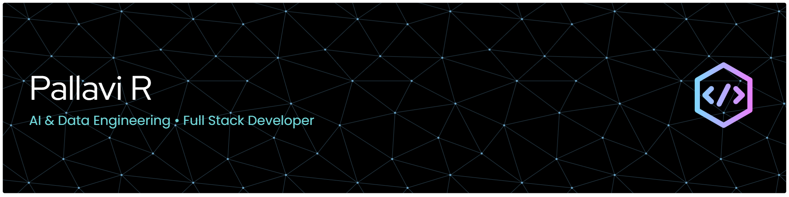

  

<h1 align="center">👋 Hi, I'm Pallavi R</h1>

<h3 align="center">
AI & Data Engineer • Full-Stack Developer
</h3>

Building intelligent AI applications, scalable data platforms, and enterprise software.

Python • SQL • FastAPI • React • TypeScript • Machine Learning • Power BI

📍 Bengaluru, India

---

## 📫 Connect With Me

---

# 🚀 Featured Projects

| 🚀 Project | Description | Tech Stack |
|------------|-------------|------------|
| 🎵 **Sonexa** | AI-powered Music Operating System featuring streaming, AI Copilot, Creator Dashboard & Music Studio | React • TypeScript • Firebase • Tailwind CSS |
| 🧠 **SkillIntel** | AI-powered Resume Analyzer with ATS scoring, career insights and interview preparation | Python • FastAPI • AI |
| 📊 **Data Visualization Dashboard** | Interactive Business Intelligence Dashboard with analytics and reporting | Power BI • SQL • Python |
| 🤖 **AI Resume Analyzer** | Resume analysis using NLP, Machine Learning and ATS scoring | Python • Machine Learning |
| 🌐 **Portfolio Website** | Modern responsive portfolio showcasing projects and skills | React • Vercel |

---

# 💫 About Me

🚀 **Professional Profile**

- 🔭 **Currently Building:** AI-powered applications, scalable data platforms, and enterprise-grade full-stack solutions.

- 🎯 **Primary Focus:** Artificial Intelligence • Data Engineering • Backend Engineering • Full-Stack Development • Intelligent Automation.

- 🤝 **Open to Collaborate On:** Open Source, AI/ML, Data Engineering, Developer Tools, and innovative software products.

- 🌱 **Currently Exploring:** Snowflake • Apache Spark • Docker • Kubernetes • MLOps • System Design • Cloud Computing • Large Language Models (LLMs).

- 💻 **Core Technologies:** Python • SQL • FastAPI • React • TypeScript • Machine Learning • Power BI • Git • REST APIs.

- ⚡ **Engineering Philosophy:** Design clean, scalable, maintainable software with a strong emphasis on performance, reliability, and user experience.

---

# 💻 Tech Stack

### 👨‍💻 Languages

### ⚛️ Frontend

### 🚀 Backend

### 🗄️ Databases

### 🤖 AI / Data Science

### 🛠️ Tools

### ☁️ Cloud & Deployment

---

# 🌐 Portfolio

---

# 📊 GitHub Analytics

  

  
  

---

# 📈 Contribution Graph

---

## 🌱 Current Focus

- 🚀 Building production-grade AI applications
- 📊 Learning Snowflake & Apache Spark
- ☁️ Exploring Azure & Google Cloud
- 🤖 Working with Machine Learning & LLMs
- 📚 Improving System Design skills

---

## 💼 Open to Opportunities

- ✅ AI Engineer
- ✅ Data Engineer
- ✅ Full-Stack Developer
- ✅ Machine Learning Engineer
- ✅ Software Engineer

📩 **Open for internships, freelance projects, and full-time opportunities.**

---

<h3 align="center">⭐ Thanks for visiting my profile ⭐</h3>

  

